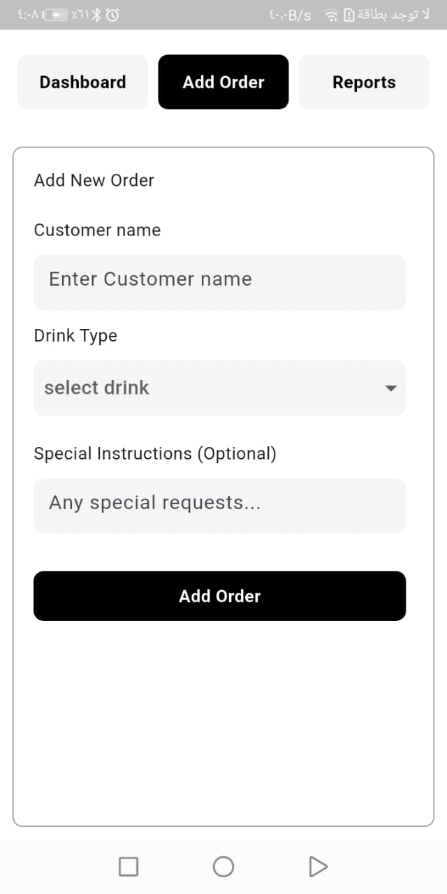
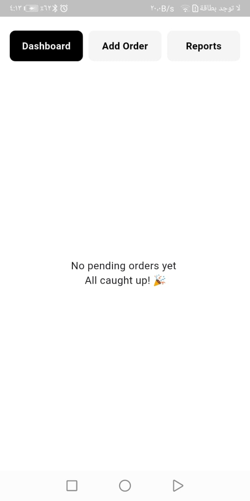
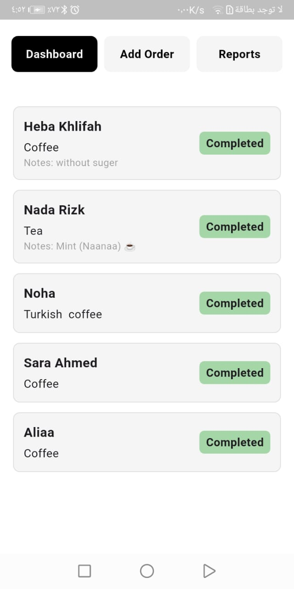
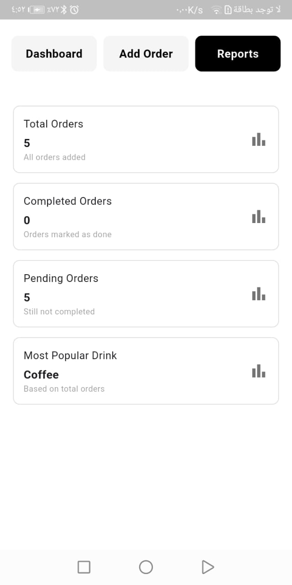

# Smart Ahwa Manager App

## 📌 Description
*Smart Ahwa Manager App* is a Flutter application designed to help manage orders in a coffee shop (Ahwa).  
It provides a simple way to add and track customer orders, and also generate basic reports and analytics.

---

## ⚙ Features
- 📝 *Add Order*  
  Add new customer orders with:
  - Customer name
  - Drink type (Tea, Turkish Coffee, Hibiscus, …)
  - Special instructions  

- 📊 *Dashboard*  
  View and manage *pending orders, and mark orders as **completed*.  

- 📈 *Reports & Analytics*  
  Generate simple reports such as:
  - Total number of orders
  - Most popular drink  

---

## 🖼 Screenshots
###  Splash


###  Add Order


###  Dashboard


###  Dashboard


### 📈 Reports


---

## 🛠 Tech Stack
- Flutter  
- Dart  

---
## 🛠 Software Design

### 🔹 Object-Oriented Programming (OOP)
- Created *Models* like Order and Drink to represent the main entities.  
- Applied *Inheritance* and *Polymorphism* in Drink (e.g., Tea, Coffee, Hibiscus).  
- Structured the code so that each class has a *clear responsibility* (Single Responsibility).  

### 🔹 SOLID Principles
- *S (Single Responsibility Principle):*  
  Each class has a single responsibility (e.g., OrderManager for managing orders, ReportService for reports).  
- *O (Open/Closed Principle):*  
  New drinks can be added by extending Drink without modifying existing code.  
- *L (Liskov Substitution Principle):*  
  Any subclass of Drink (like Tea) can replace another without breaking the code.  
- *I (Interface Segregation Principle):*  
  Classes are designed so they don’t have to implement methods they don’t need.  
- *D (Dependency Inversion Principle):*  
  Order depends on the abstraction (Drink) rather than a concrete implementation.
---  
## 🚀 How to Run
1. Clone the repository:
   ```bash
   git clone https://github.com/hebakhalif/Smart-Ahwa-Manager-App.git
