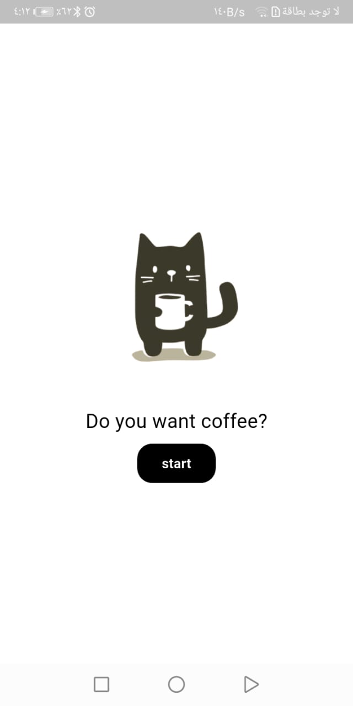

# Smart Ahwa Manager App

## 📌 Description
*Smart Ahwa Manager App* is a Flutter application designed to help manage orders in a coffee shop (Ahwa).  
It provides a simple way to add and track customer orders, and also generate basic reports and analytics.

---

## ⚙ Features
- 📝 *Add Order*  
  Add new customer orders with:
  - Customer name
  - Drink type (Tea, Turkish Coffee, Hibiscus, …)
  - Special instructions  

- 📊 *Dashboard*  
  View and manage *pending orders, and mark orders as **completed*.  

- 📈 *Reports & Analytics*  
  Generate simple reports such as:
  - Total number of orders
  - Most popular drink  

---

## 🖼 Screenshots
###  Splash


###  Add Order


###  Dashboard


###  Dashboard


### 📈 Reports


---

## 🛠 Tech Stack
- Flutter  
- Dart  

---

## 🚀 How to Run
1. Clone the repository:
   ```bash
   git clone https://github.com/your-username/smart-ahwa-manager-app.git 
